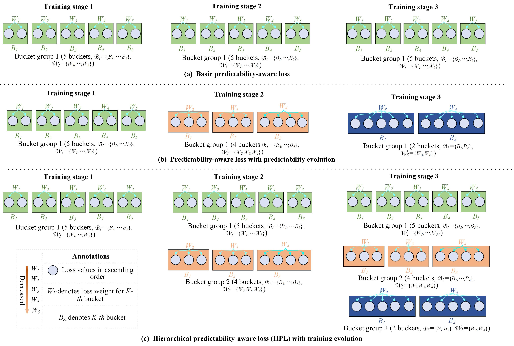
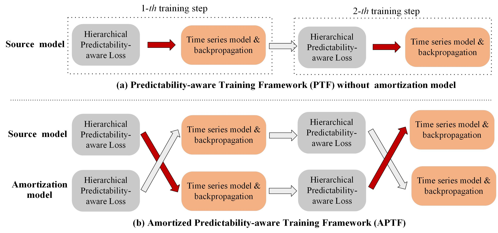

# Amortized Predictability-aware Training Framework for Time Series Forecasting and Classification (APTF, WWW 2026)

## Overview

APTF employs a hierarchical bucketing strategy that progressively penalizes the loss of low-predictability samples during training. This design enables the model to focus on high-predictability samples while still learning appropriately from low-predictability ones, with a reduced risk of overfitting to noise:

By introducing the amortization model, the predictability estimation error (bias) will first be amortized by it and then passed to the source model after a delay of one training step, as red arrows in the following Figure (b). This helps reduce the risk of the source model misidentifying highly predictable samples as low-predictability samples due to overconfidence and bias:

## Downloading Datasets

We have collected the dataset from the official websites, which can be directly obtained from this link: https://drive.google.com/drive/folders/1SK2Hi2bTeLL0cQMWJERC5QHBxMEHsRlM?usp=sharing, including 8 long-term TSF datasets (ETTh1, ETTh2, ETTm1, ETTm2, weather, electricity and traffic), 3 short-term Fund datasets (Fund1, Fund2 and Fund3) and 128 UCR TSC datasets (the password for extracting the compressed file is "someone"). The downloaded folders should be placed at the "dataset" folder. The public datasets are extensively used for evaluating performance of various time series forecasting methods.
  
## Reproducing Paper Results

The paper results can be reproduced by running the "Main_TSC", "Main_LongTerm_TSF.py" and "Main_ShortTerm_TSF.py" scripts, including whether using the Hierarchical Predictability-aware Loss (HPL) and amortization model, or comparison between our APTF and Wavebound. 

